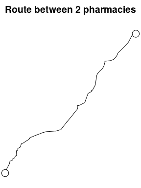
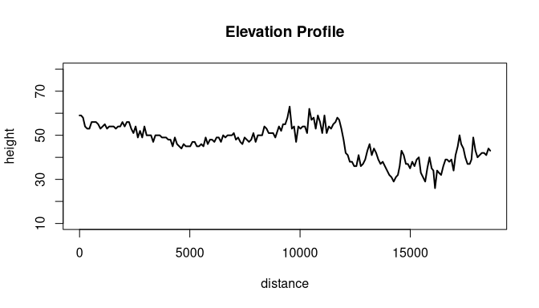

# valh 

[](https://CRAN.R-project.org/package=valh)
[](https://github.com/riatelab/valh/actions)
[](https://app.codecov.io/gh/riatelab/valh)
[](https://www.repostatus.org/#active)

## Description

This package provides an interface to the Valhalla API from R.
[Valhalla](https://valhalla.github.io/valhalla/) is a routing service
that is based on OpenStreetMap data. It allows you to query the Valhalla
API for routes, isochrones, time-distance matrices, nearest point on the
road network, and elevation data.

This package relies on the usage of a [running Valhalla
server](https://github.com/riatelab/valh?tab=readme-ov-file#installing-your-own-valhalla-server)
(tested with versions 3.4.x and 3.5.x of Valhalla).


<small>[code for the
map](https://gist.github.com/rCarto/8dfba641b807c20c8cbf72ef8ed0c9c5)<small/>

## Features

- `vl_route()`: Get route between locations.
- `vl_matrix()`: Get travel time matrices between points.
- `vl_locate()`: Get the nearest point on the road network.
- `vl_elevation()`: Get elevation data at given location(s).
- `vl_isochrone()`: Get isochrone polygons.
- `vl_optimized_route()`: Get optimized route between locations.
- `vl_status()`: Get information on Valhalla service.

## Installation

- Stable version from CRAN:

``` r
install.packages("valh")
```

- Development version from the r-universe.

``` r
install.packages("valh", repos = "https://riatelab.r-universe.dev")
```

## Demo

This is a short overview of the main features of `valh`. The dataset
used here is shipped with the package, it is a sample of 100 random
pharmacies in Berlin ([© OpenStreetMap
contributors](https://www.openstreetmap.org/copyright/en)) stored in a
[geopackage](https://www.geopackage.org/) file.

It demonstrates the use of `vl_matrix`, `vl_route` and `vl_elevation`
functions.

``` r
library(valh)
```

    ## Data: (c) OpenStreetMap contributors, ODbL 1.0 - http://www.openstreetmap.org/copyright

    ## Routing: Valhalla - valhalla.github.io/valhalla

``` r
library(sf)
```

    ## Linking to GEOS 3.13.1, GDAL 3.10.3, PROJ 9.6.0; sf_use_s2() is TRUE

``` r
pharmacy <- st_read(system.file("gpkg/apotheke.gpkg", package = "valh"), quiet = TRUE)
pharmacy <- pharmacy[1:10, ]
```

One of valhalla’s strengths is that it allows you to use dynamic costing
options at query time. For example, we can compare the travel time
between each pharmacy by bicycle:

- with the default bicycle parameters (type of bicycle “hybrid” with an
  average speed of 18 km/h and a propensity to use roads, alongside
  other vehicles, of 0.5 out of 1 - the default value),
- with the road bicycle parameters (type of bicycle “road” with an
  average speed of 25 km/h and a propensity to use roads, alongside
  other vehicles, of 1 out of 1).

These costing options for each costing model (‘auto’, ‘bicycle’, etc.)
are documented in [Valhalla’s
documentation](https://valhalla.github.io/valhalla/api/turn-by-turn/api-reference/#costing-models).

``` r
default_bike <- vl_matrix(loc = pharmacy, costing = "bicycle")

road_bike <- vl_matrix(loc = pharmacy, costing = "bicycle",
                       costing_options = list(bicycle_type = "Road", use_roads = "1"))
```

The object returned by `vl_matrix` is a list with 4 elements:

- `sources`: origin point coordinates,
- `destinations`: destination point coordinates,
- `distances` : distance matrix between sources and destinations,
- `durations` : travel time matrix between sources and destinations.

``` r
default_bike$durations[1:5, 1:5]
```

    ##      1    2    3    4    5
    ## 1  0.0 45.7 77.0 36.5 18.0
    ## 2 48.9  0.0 98.4 30.8 43.5
    ## 3 76.4 96.3  0.0 62.3 61.7
    ## 4 33.2 29.7 61.7  0.0 20.4
    ## 5 18.6 43.6 62.8 23.8  0.0

``` r
road_bike$durations[1:5, 1:5]
```

    ##      1    2    3    4    5
    ## 1  0.0 32.8 51.2 25.2 13.1
    ## 2 34.1  0.0 62.4 22.5 31.2
    ## 3 49.7 62.6  0.0 44.0 40.9
    ## 4 23.0 21.3 43.4  0.0 14.9
    ## 5 12.4 30.3 41.8 15.5  0.0

We can see not only that travel times are different (which is to be
expected, given that we’ve changed the cyclist’s default speed), but
also that the path taken are different (as a consequence of the change
in preference for using roads rather than cycle paths).

``` r
default_bike$distances - road_bike$distances
```

    ##         1      2      3      4      5      6      7      8      9     10
    ## 1   0.000  0.071  1.052  0.653  0.040  0.026  1.492 -0.003 -0.865  0.014
    ## 2   0.017  0.000  2.376 -0.513 -0.001  0.045  0.865 -0.001  1.114  0.494
    ## 3   1.176  2.107  0.000  0.074  0.759  0.405  0.069  0.750  0.812  1.172
    ## 4   0.238 -0.343  0.042  0.000  0.013 -0.155  1.309  0.097 -0.385  0.238
    ## 5   0.506  0.026  0.440  0.653  0.000  0.016 -0.872  0.000 -0.813  0.019
    ## 6   0.009  0.767 -0.414 -0.123  0.012  0.000  0.132  0.001 -0.072  0.010
    ## 7   0.013  0.111  0.016  0.053  0.047  0.040  0.000  0.054 -0.053  0.005
    ## 8  -0.053  0.035  0.486  0.001  0.018  0.005  0.787  0.000 -0.340 -0.057
    ## 9  -0.386 -0.173  0.557 -0.302  0.190 -0.794 -0.204 -0.221  0.000 -0.390
    ## 10  0.000  0.025 -1.127  0.724  0.089  0.028  1.489 -0.006 -0.868  0.000

We now calculate a route between two points, by foot, using the
`vl_route` function and calculate the elevation profile of the returned
route, using the `vl_elevation` function.

``` r
p1 <- pharmacy[3, ]
p2 <- pharmacy[6, ]
route <- vl_route(p1, p2, costing = "pedestrian")
plot(st_geometry(route), main = "Route between 2 pharmacies")
plot(c(st_geometry(p1), st_geometry(p2)), pch = 21, cex = 2, add = TRUE)
```

<!-- -->

``` r
# We transform the LineString to Point geometries
pts_route <- sf::st_cast(st_geometry(route), "POINT")

elev <- vl_elevation(loc = pts_route, sampling_dist = 100)
```

The object returned is an sf object with a point for each location where
the altitude has been sampled and with the attributes ‘distance’ (the
cumulative distance to the first point) and ‘height’ (the altitude).

We can use it to plot the elevation profile of the route.

``` r
plot(as.matrix(st_drop_geometry(elev)), type = "l", lwd = 2, ylim = c(20, 70), asp = 100,
     main = "Elevation Profile")
```

<!-- -->

## Installing your own Valhalla server

We’ve included a
[vignette](https://CRAN.R-project.org/package=valh/vignettes/install-valhalla.html)
showing how to install your own instance of Valhalla, either locally or
on a remote server, using Docker.

## Motivation & Alternatives

The package is designed to provide an easy-to-use interface to the
Valhalla routing service from R. Special care has been taken to support
multiple input formats, and the package treats `sf` objects as
first-class citizens in both input and output. Additionally, we have
tried to maintain a minimal number of dependencies.

This package offers an API that closely resembles that of the
[`osrm`](https://github.com/riatelab/osrm) package which provides an R
interface to the OSRM routing service.

Note that there are other packages that provide an interface to Valhalla
API from R :

- [valhallr](https://github.com/chris31415926535/valhallr/): This
  package is on CRAN. It provides access to some of Valhalla’s services
  (*height*, *locate* and *optimized route* are notably missing). It
  depends on a number of rather heavy packages and it does not allow
  `sf` objects as input.
- [rvalhalla](https://github.com/Robinlovelace/rvalhalla): This package
  is not on CRAN. Although it can provide access to several Valhalla
  services, it only makes it easy to use two of them (*route* and
  *sources_to_target*). It does not accept `sf` objects as input.

## Community Guidelines

One can contribute to the package through [pull
requests](https://github.com/riatelab/valh/pulls) and report issues or
ask questions [here](https://github.com/riatelab/valh/issues). See the
[CONTRIBUTING.md](https://github.com/riatelab/valh/blob/master/CONTRIBUTING.md)
file for detailed instructions.
